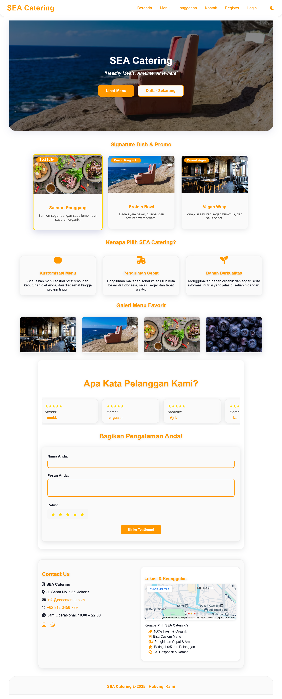
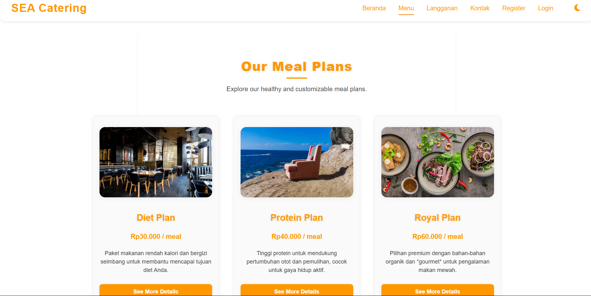
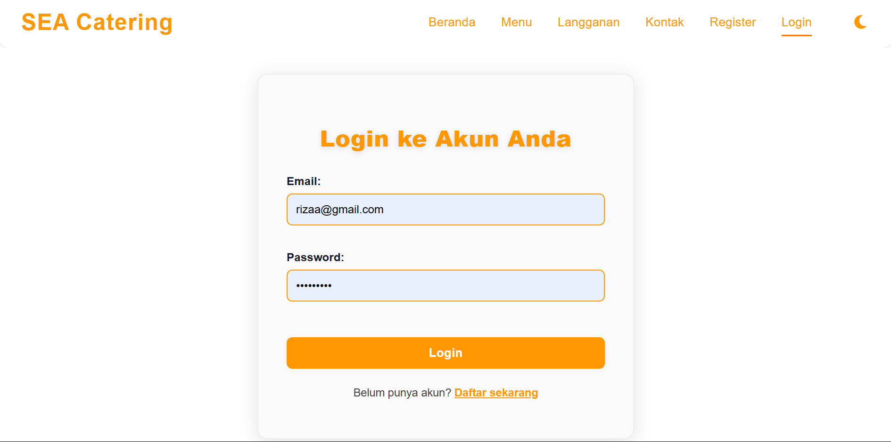
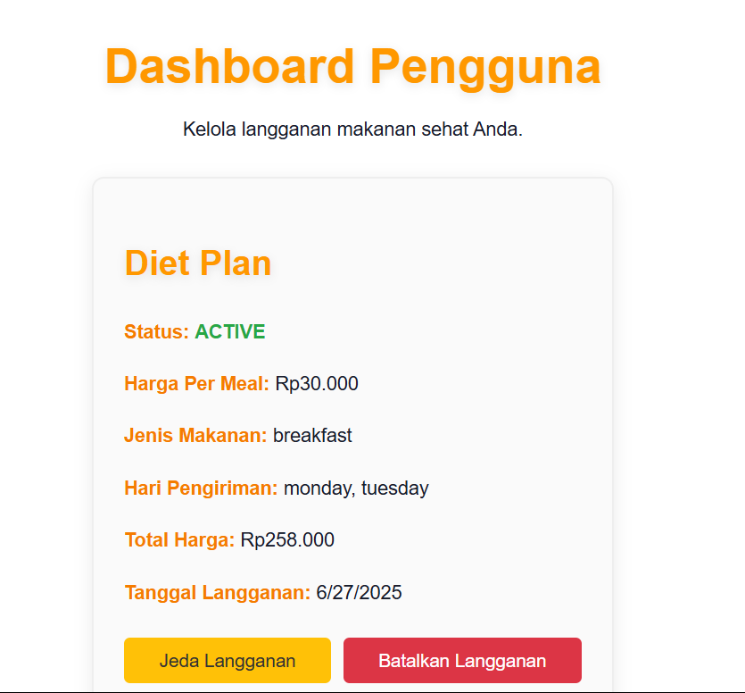
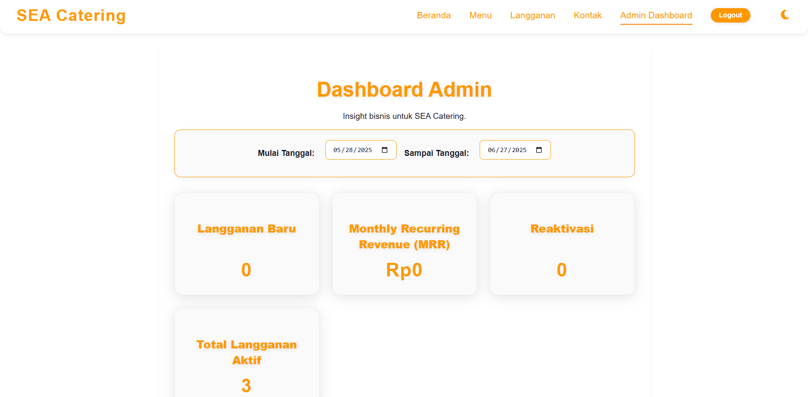

# SEA Catering Application

![SEA Catering ]



Light Mode


Dark Mode


Aplikasi SEA Catering adalah platform web/mobile yang dirancang untuk streamline pemesanan dan pengelolaan paket makanan sehat kustomisasi, sekaligus menyediakan insight bisnis esensial bagi manajemen. Proyek ini dibangun sebagai solusi full-stack dalam tantangan bootcamp, mencakup fungsionalitas inti dari frontend, backend, hingga integrasi database dan aspek keamanan.

---

## Fitur Utama

* **Homepage:** Landing page informatif dengan detail bisnis, slogan, fitur utama, dan kontak.
* **Navigasi Interaktif:** Sistem navigasi responsif, menautkan ke halaman utama, menu, langganan, dan kontak.
* **Menu & Paket Makanan:** Tampilan interaktif paket makanan dengan detail via modal/pop-up.
* **Testimoni:** Bagian ulasan pelanggan dengan formulir pengiriman dan carousel testimoni.
* **Sistem Langganan:** Formulir kustomisasi paket makanan dengan perhitungan harga otomatis, terintegrasi penuh dengan database.
* **Autentikasi & Otorisasi:** Registrasi dan login pengguna (bcryptjs, JWT), dengan perlindungan rute berdasarkan peran (user/admin).
* **Validasi & Sanitasi Input:** Validasi ketat di frontend dan backend untuk keamanan data dan mencegah serangan umum (XSS, dll.).
* **User Dashboard:** Pengguna dapat melihat dan mengelola langganan pribadi (jeda, batal).
* **Admin Dashboard:** Admin dapat memantau metrik bisnis kunci: Langganan Baru, Monthly Recurring Revenue (MRR), Reaktivasi, dan Total Langganan Aktif, dengan filter rentang tanggal.

---

## Teknologi yang Digunakan

* **Frontend:** React.js, Vite, React Router DOM, CSS3
* **Backend:** Node.js, Express.js, MongoDB (via MongoDB Atlas), Mongoose, Bcrypt.js, jsonwebtoken, CORS, Dotenv

---

## Cara Menjalankan Proyek Secara Lokal

Pastikan Anda memiliki **Node.js (dengan npm/Yarn), Git, dan akun MongoDB Atlas** yang sudah dikonfigurasi (cluster, database user dengan hak `readWrite`, network access).

1.  **Clone Repository:**
    ```bash
    git clone https://github.com/Mangriza/Sea-Catering.git
    cd sea-catering-app
    ```

2.  **Konfigurasi Backend (Server):**
    ```bash
    cd server
    npm install
    touch .env # Untuk Windows: type nul > .env
    ```
    Isi file `.env` dengan konfigurasi berikut. **Ganti placeholder** dengan kredensial Anda.
    ```env
    MONGO_URI=mongodb+srv://<YOUR_MONGODB_USERNAME>:<YOUR_ENCODED_MONGODB_PASSWORD>@cluster0.xmzmgej.mongodb.net/?retryWrites=true&w=majority&appName=Cluster0
    PORT=5000
    JWT_SECRET=YOUR_SUPER_SECURE_JWT_KEY_HERE # Minimal 32 karakter, acak.
    ```
    * **Catatan Penting:** Jika password MongoDB Anda mengandung karakter `@`, `:`, atau `/`, **pastikan untuk meng-encode-nya** (misalnya, `@` menjadi `%40`).
    * **Untuk Akun Admin:** Buat akun admin secara **manual di MongoDB Atlas** (`users` collection). Gunakan `role: "admin"` dan pastikan `password` adalah **nilai hash** (gunakan `bcrypt.hash()` dari Node.js REPL untuk mendapatkannya). Contoh akun: `email: admin@seacatering.com`, `password: <HASHED_PASSWORD_ANDA>`.

3.  **Jalankan Backend:**
    ```bash
    node index.js
    ```
    Verifikasi `MongoDB connected successfully` dan `Server is running on port 5000`.

4.  **Konfigurasi Frontend (Client):**
    ```bash
    cd ../client
    npm install
    ```

5.  **Jalankan Frontend:**
    ```bash
    npm run dev
    ```
    Buka `http://localhost:5173/` di browser Anda.

---

## 9. Screenshot Aplikasi

Sertakan *screenshot* yang jelas untuk setiap bagian kunci aplikasi. Simpan gambar di folder `docs/` di *root* proyek Anda (`sea-catering-app/docs/`) dan sesuaikan *path* di bawah.


* **Menu / Meal Plans (dengan modal detail):**

* **Formulir Langganan:**

* **Halaman Registrasi/Login:**

* **User Dashboard:**

* **Admin Dashboard:**


---

## Deployment (Poin Bonus)

https://sea-catering-eight.vercel.app/
---

## Kontak

Untuk pertanyaan atau informasi lebih lanjut, silakan hubungi:

* rizabucarelli@gmail.com

---
